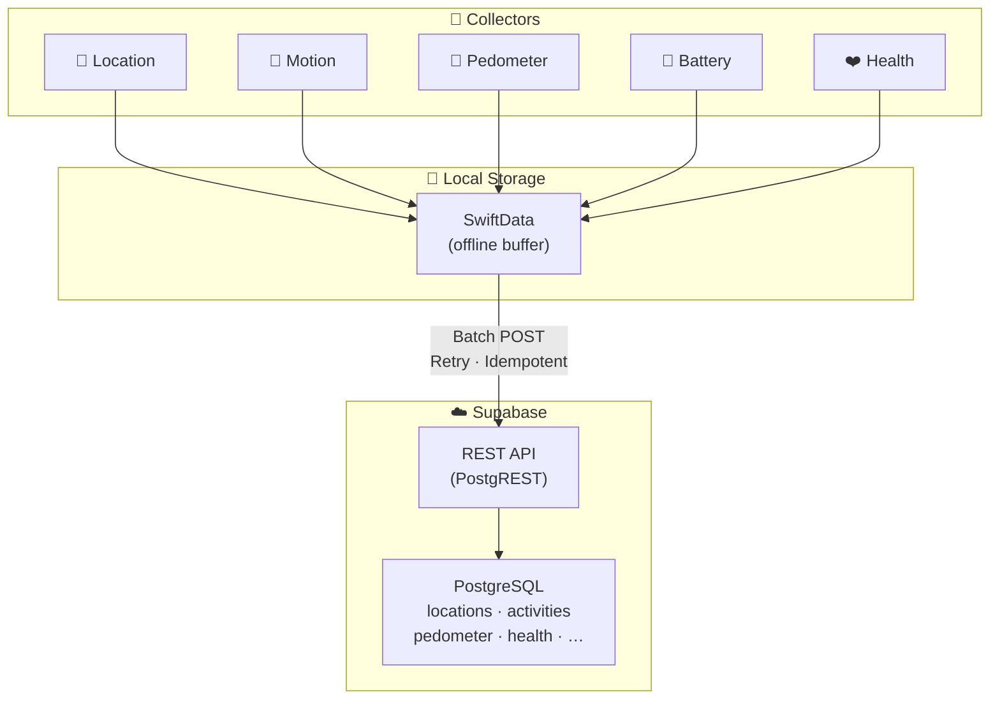

<div align="center">

# 🧳 Porter

**Your iPhone's silent data courier.**

Porter passively collects sensor data from your iPhone and streams it to your own<br>[Supabase](https://supabase.com) Postgres database — no interaction, no subscriptions, no vendor lock-in.

The physical-world data layer for [OpenClaw](https://github.com/openclaw/openclaw) and your personal AI stack. 🦞

<br>

[](https://swift.org)
[](https://developer.apple.com/ios/)
[](https://developer.apple.com/xcode/swiftui/)
[](https://supabase.com)
[](https://github.com/openclaw/openclaw)
[](LICENSE)

<br>

<!-- 
  TODO: Replace with actual screenshots before publishing
  <p>
    
    &nbsp;&nbsp;
    
    &nbsp;&nbsp;
    
  </p>
-->

**Set it up once. Put your phone in your pocket. Forget about it.**

<br>

[Quick Start](#-quick-start) · [Data Sources](#-data-sources) · [OpenClaw Integration](#-porter--openclaw) · [Architecture](#%EF%B8%8F-architecture) · [Roadmap](#%EF%B8%8F-roadmap)

</div>

<br>

## Why Porter?

Most self-tracking apps want you to open them, tap buttons, and remember to log things. **Porter takes the opposite approach.** Configure it once, and it silently collects data from your iPhone's sensors in the background — uploading everything to a Supabase Postgres database that **you** own.

> **Your data. Your database. Your queries.** No proprietary cloud, no monthly subscription, no export limitations.

Porter is for developers and data nerds who want raw access to their own behavioral data — to build dashboards, train models, feed their personal AI, or just satisfy curiosity.

---

## 🦞 Porter + OpenClaw

**[OpenClaw](https://github.com/openclaw/openclaw)** is the open-source personal AI assistant with 300k+ stars — it lives in your messaging apps (WhatsApp, Telegram, iMessage, Slack, Discord, …) and acts as your always-on AI. But OpenClaw only knows what you *tell* it.

**Porter gives OpenClaw a body.**

While OpenClaw handles your digital life — messages, tasks, reminders, web searches — Porter silently feeds it your physical-world context: where you are, how you move, your health metrics, your device state. Together, they form a **complete personal AI that understands both your digital and physical life.**

```
┌──────────────────────────────────────────────────────────────┐
│                     Your Personal AI Stack                   │
│                                                              │
│  ┌─────────────┐    Supabase     ┌────────────────────────┐  │
│  │  📱 Porter  │───(Postgres)───▶│  🦞 OpenClaw           │  │
│  │             │                 │                        │  │
│  │  Location   │  "Where was I   │  WhatsApp · Telegram   │  │
│  │  Motion     │   last Tuesday  │  iMessage · Slack      │  │
│  │  Steps      │   at 3pm?"      │  Discord · Signal      │  │
│  │  Health     │                 │  ...20+ channels       │  │
│  │  Battery    │  ──────────▶    │                        │  │
│  │  Network    │  Answers with   │  Skills · Memory       │  │
│  │             │  YOUR data      │  Voice · Canvas        │  │
│  └─────────────┘                 └────────────────────────┘  │
└──────────────────────────────────────────────────────────────┘
```

**What this unlocks:**

| You ask OpenClaw… | Porter provides… |
|---|---|
| *"Where was I last Tuesday afternoon?"* | GPS location history |
| *"How active was I this week?"* | Step count, distance, activity types |
| *"What's my average commute time?"* | Location patterns + motion data |
| *"Did I sleep well last night?"* | HealthKit sleep analysis |
| *"How much time did I spend at the office?"* | Location dwell times |
| *"Am I more active on weekdays or weekends?"* | Pedometer + activity trends |

OpenClaw can query Porter's Supabase tables via a [skill](https://docs.openclaw.ai/tools/skills) or through its built-in [tool system](https://docs.openclaw.ai/tools) — just point it at your Supabase project and it has full SQL access to your physical-world data.

> 💡 **OpenClaw knows what you say. Porter knows what you do.** Together, they know *you*.

---

## 📡 Data Sources

| | Collector | Framework | What it captures | Status |
|:---:|-----------|-----------|------------------|:------:|
| 📍 | **Location** | CoreLocation | GPS coordinates, altitude, speed, accuracy | ✅ |
| 🚶 | **Activity** | CoreMotion | Stationary · Walking · Running · Cycling · Driving | 🔜 |
| 👟 | **Pedometer** | CoreMotion | Steps, distance, floors climbed, cadence | 🔜 |
| 🌡️ | **Altimeter** | CoreMotion | Barometric pressure, relative altitude | 🔜 |
| 🔋 | **Battery** | UIKit | Battery level and charging state | 🔜 |
| 📶 | **Connectivity** | Network | Wi-Fi / Cellular / None, connection quality | 🔜 |
| ❤️ | **Health** | HealthKit | Heart rate, energy burned, sleep, workouts | 🔜 |

Each collector runs independently, can be toggled on/off, and uploads to its own Supabase table.

---

## 💡 How It Works

```
┌─────────┐       ┌─────────┐       ┌─────────┐
│         │       │         │       │         │
│  📱     │──────▶│  💾     │──────▶│  ☁️     │
│  Sense  │       │  Buffer │       │  Sync   │
│         │       │         │       │         │
└─────────┘       └─────────┘       └─────────┘
 Collectors        SwiftData         Supabase
 gather data       stores locally    uploads when
 in background     offline-first     connected
```

**1. Sense** — Collectors subscribe to iOS system events (location changes, motion updates, etc.)  
**2. Buffer** — Every data point is persisted to SwiftData immediately, even without connectivity  
**3. Sync** — The upload service batches pending records and POSTs them to your Supabase project  

Records that fail to upload are retried automatically (up to 5 attempts). UUID primary keys guarantee idempotency — you'll never get duplicates.

---

## 🔍 Query Your Life

Once Porter is running, your Supabase database becomes a queryable journal of your life. Here are some things you can ask:

```sql
-- Where do I spend most of my time?
SELECT
  round(latitude::numeric, 3) AS lat,
  round(longitude::numeric, 3) AS lng,
  count(*) AS visits
FROM locations
GROUP BY lat, lng
ORDER BY visits DESC
LIMIT 10;
```

```sql
-- How many km did I travel last week?
WITH ordered AS (
  SELECT *,
    lag(latitude) OVER (ORDER BY recorded_at) AS prev_lat,
    lag(longitude) OVER (ORDER BY recorded_at) AS prev_lng
  FROM locations
  WHERE recorded_at > now() - interval '7 days'
)
SELECT round(sum(
  earth_distance(ll_to_earth(latitude, longitude), ll_to_earth(prev_lat, prev_lng))
) / 1000) AS km_traveled
FROM ordered
WHERE prev_lat IS NOT NULL;
```

```sql
-- What's my daily step count trend?
SELECT
  date_trunc('day', period_start) AS day,
  sum(steps) AS total_steps
FROM pedometer
GROUP BY day
ORDER BY day DESC
LIMIT 30;
```

> 💡 This is the point — **your data lives in Postgres**, so you can query it with SQL, connect it to Grafana, pipe it into a Jupyter notebook, build your own API on top, or let [OpenClaw](https://github.com/openclaw/openclaw) query it for you in natural language.

---

## ✨ Features

### 🔋 Battery-first
Collectors use system-triggered events — significant location changes, motion coprocessor updates, HealthKit background delivery — instead of GPS polling or timers. Your battery barely notices.

### 📴 Offline-first
All records are buffered locally with SwiftData. No signal? No problem. Porter syncs everything when connectivity returns.

### 🔐 Secure by default
API keys live in the iOS Keychain — not in UserDefaults, not in code. HTTPS everywhere. UUID primary keys make every upload idempotent.

### 🧩 Modular collectors
Every data source follows a common `DataCollector` protocol. Adding a new sensor is just conforming to the protocol — the upload pipeline handles the rest.

### ☁️ No server to maintain
Uploads directly to Supabase's REST API (PostgREST). Spin up a free Supabase project and you're done. No custom backend, no infra, no Docker.

### 🔁 Automatic retry
Failed uploads are retried up to 5 times with exponential backoff tracking. Nothing gets silently dropped.

---

## 🚀 Quick Start

### Prerequisites

- **Xcode 15+** and a device running **iOS 17.0+**
- A free [Supabase](https://supabase.com) project

### 1. Set up Supabase

<details>
<summary><strong>📋 Click to expand — SQL schema for all tables</strong></summary>

<br>

Run this in your Supabase project's **SQL Editor**:

```sql
-- 📍 Location data
CREATE TABLE locations (
  id UUID PRIMARY KEY,
  latitude DOUBLE PRECISION NOT NULL,
  longitude DOUBLE PRECISION NOT NULL,
  altitude DOUBLE PRECISION,
  horizontal_accuracy DOUBLE PRECISION,
  speed DOUBLE PRECISION,
  recorded_at TIMESTAMPTZ NOT NULL,
  created_at TIMESTAMPTZ DEFAULT NOW()
);
CREATE INDEX idx_locations_recorded_at ON locations (recorded_at DESC);

-- 🚶 Motion activity detection
CREATE TABLE activities (
  id UUID PRIMARY KEY,
  activity_type TEXT NOT NULL,
  confidence TEXT NOT NULL,
  started_at TIMESTAMPTZ NOT NULL,
  recorded_at TIMESTAMPTZ NOT NULL,
  created_at TIMESTAMPTZ DEFAULT NOW()
);

-- 👟 Pedometer
CREATE TABLE pedometer (
  id UUID PRIMARY KEY,
  steps INT NOT NULL,
  distance DOUBLE PRECISION,
  floors_ascended INT,
  floors_descended INT,
  cadence DOUBLE PRECISION,
  period_start TIMESTAMPTZ NOT NULL,
  period_end TIMESTAMPTZ NOT NULL,
  created_at TIMESTAMPTZ DEFAULT NOW()
);

-- 🌡️ Barometric altimeter
CREATE TABLE altimeter (
  id UUID PRIMARY KEY,
  pressure DOUBLE PRECISION NOT NULL,
  relative_altitude DOUBLE PRECISION,
  recorded_at TIMESTAMPTZ NOT NULL,
  created_at TIMESTAMPTZ DEFAULT NOW()
);

-- 🔋 Battery state
CREATE TABLE battery (
  id UUID PRIMARY KEY,
  level DOUBLE PRECISION NOT NULL,
  state TEXT NOT NULL,
  recorded_at TIMESTAMPTZ NOT NULL,
  created_at TIMESTAMPTZ DEFAULT NOW()
);

-- 📶 Network connectivity
CREATE TABLE connectivity (
  id UUID PRIMARY KEY,
  network_type TEXT NOT NULL,
  is_expensive BOOLEAN,
  is_constrained BOOLEAN,
  recorded_at TIMESTAMPTZ NOT NULL,
  created_at TIMESTAMPTZ DEFAULT NOW()
);

-- ❤️ Health data
CREATE TABLE health (
  id UUID PRIMARY KEY,
  metric_type TEXT NOT NULL,
  value DOUBLE PRECISION,
  unit TEXT,
  metadata JSONB,
  started_at TIMESTAMPTZ,
  ended_at TIMESTAMPTZ,
  recorded_at TIMESTAMPTZ NOT NULL,
  created_at TIMESTAMPTZ DEFAULT NOW()
);
```

Then enable **Row Level Security (RLS)** and create INSERT policies for the service-role key on each table.

</details>

### 2. Clone & build

```bash
git clone https://github.com/user/Porter.git
open Porter.xcodeproj
```

Select your physical device and hit **⌘R**. (Location services require real hardware.)

### 3. Configure & go

1. Complete the permission onboarding flow
2. Tap **⚙️** → enter your Supabase **Project URL** and **service-role key**
3. Toggle tracking on

**That's it. Put your phone in your pocket. Porter handles the rest.**

---

## 🏗️ Architecture



---

## 📂 Project Structure

```
Porter/
├── PorterApp.swift              # App entry, service wiring
├── ContentView.swift            # Onboarding ↔ dashboard router
├── Models/
│   └── LocationRecord.swift     # SwiftData model + upload status
├── Services/
│   ├── LocationManager.swift    # CoreLocation background monitoring
│   ├── UploadService.swift      # Batch upload to Supabase REST API
│   ├── KeychainHelper.swift     # Secure credential storage
│   └── AppSettings.swift        # User preferences & config
└── Views/
    ├── DashboardView.swift      # Live tracking status & stats
    ├── SettingsView.swift       # Supabase connection config
    └── PermissionView.swift     # Progressive permission onboarding
```

---

## 🗺️ Roadmap

| Phase | Focus | Description |
|:-----:|-------|-------------|
| **1** | 🧩 Architecture | `DataCollector` protocol, refactor location collector, generalize upload service for multi-table support |
| **2** | 🚶 Motion & Activity | Activity type detection, pedometer (steps/distance/floors), barometric altitude |
| **3** | 📱 Device Context | Battery level & charging state, network connectivity monitoring |
| **4** | ❤️ Health | HealthKit integration — heart rate, active energy, sleep analysis, workouts (with background delivery) |
| **5** | 🧠 Intelligence | Automatic trip detection, data export (CSV/JSON), dashboard charts & visualizations |

See the full breakdown in the [plan](/plan.md) *(coming soon)*.

---

## 🤝 Contributing

Contributions are welcome! Whether it's a new collector, a bug fix, or improved docs — open an issue or submit a PR.

```bash
# Fork, clone, branch
git checkout -b feat/awesome-collector

# Make changes, then
git commit -m 'Add awesome collector'
git push origin feat/awesome-collector
```

**Ideas for contributions:**
- 🆕 New collector (Bluetooth, NFC, screen time, …)
- 🦞 OpenClaw skill for querying Porter data in natural language
- 📊 Grafana dashboard templates for the Supabase data
- 🧪 Unit tests for upload retry logic
- 📱 Widget extension for quick status glance

---

## 📄 License

[MIT](LICENSE) — use it however you want.

---

<div align="center">

<br>

**Porter is free and open source.**<br>
If you find it useful, a ⭐ on GitHub goes a long way.

<br>

Made with Swift · SwiftUI · SwiftData · Supabase<br>
Pairs beautifully with [🦞 OpenClaw](https://github.com/openclaw/openclaw)

</div>
