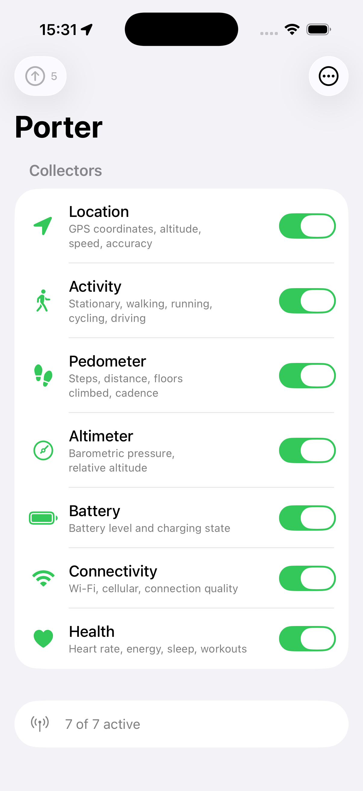
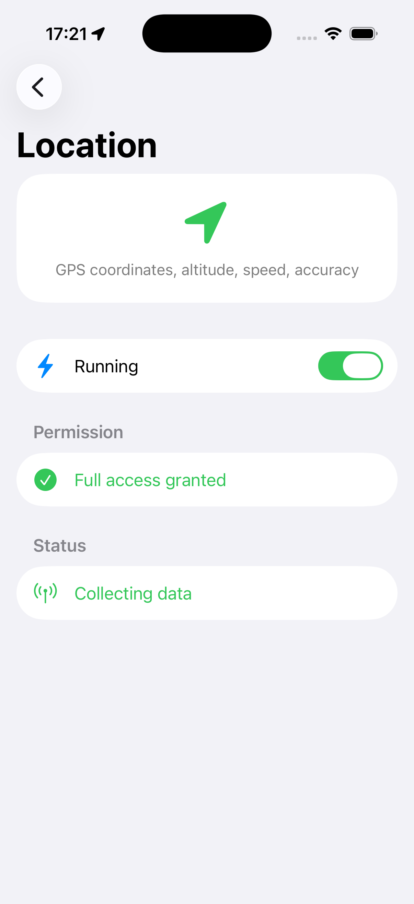
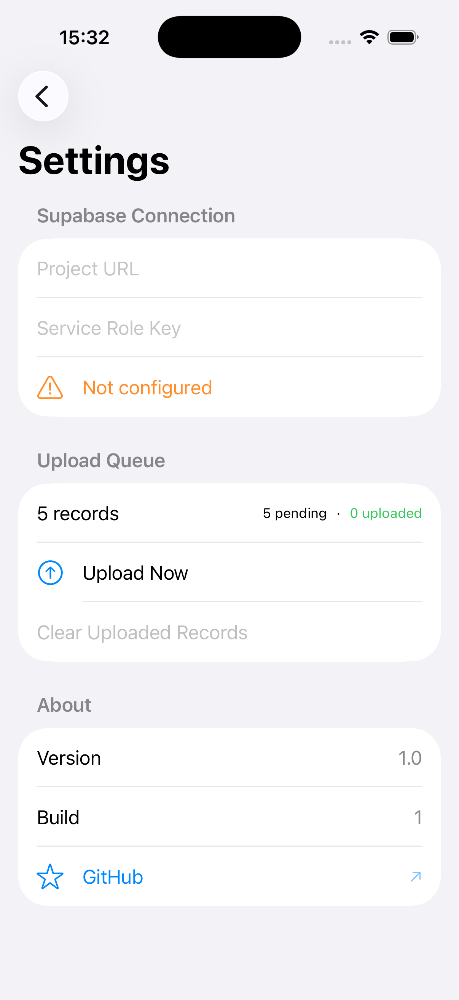
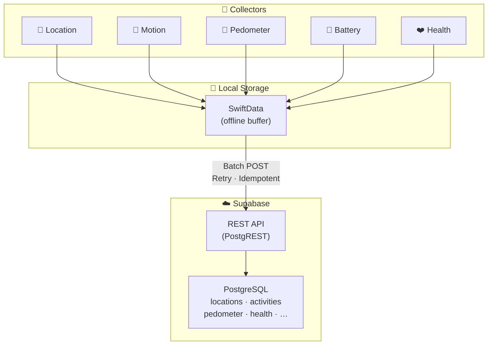

<div align="center">

# 📡 ClawAntenna

**The sensory companion for [OpenClaw](https://github.com/openclaw/openclaw).** 🦞

ClawAntenna gives OpenClaw physical-world awareness — passively collecting sensor data<br>from your iPhone and streaming it to your [Supabase](https://supabase.com) Postgres, where OpenClaw can query it.

<br>

[](https://swift.org)
[](https://developer.apple.com/ios/)
[](https://developer.apple.com/xcode/swiftui/)
[](https://supabase.com)
[](https://github.com/openclaw/openclaw)
[](LICENSE)

<br>

<p>
  
  &nbsp;&nbsp;&nbsp;&nbsp;
  
  &nbsp;&nbsp;&nbsp;&nbsp;
  
</p>

**Set it up once. Put your phone in your pocket. Let OpenClaw do the rest.**

<br>

[Why ClawAntenna?](#-why-clawantenna) · [Data Sources](#-data-sources) · [Quick Start](#-quick-start) · [Connect to OpenClaw](#-connect-to-openclaw) · [Architecture](#%EF%B8%8F-architecture) · [Roadmap](#%EF%B8%8F-roadmap)

</div>

<br>

## 🦞 Why ClawAntenna?

[OpenClaw](https://github.com/openclaw/openclaw) is the open-source personal AI assistant with 300k+ stars — it lives in your messaging apps and acts as your always-on AI. But it only knows what you *tell* it.

**ClawAntenna bridges the gap between your physical life and your AI.** It silently collects sensor data from your iPhone in the background, uploading everything to a Supabase Postgres database that OpenClaw can query directly — so it can answer questions about your real-world behavior without you ever logging anything manually.

> **OpenClaw knows what you say. ClawAntenna knows what you do.** Together, they know *you*.

```
┌──────────────────────────────────────────────────────────────┐
│                    Your Personal AI Stack                    │
│                                                              │
│  ┌───────────────┐   Supabase    ┌────────────────────────┐  │
│  │📡 ClawAntenna │──(Postgres)──▶│ 🦞 OpenClaw            │  │
│  │               │               │                        │  │
│  │  Location     │ "Where was I  │  WhatsApp · Telegram   │  │
│  │  Motion       │  last Tuesday │  iMessage · Slack      │  │
│  │  Steps        │  at 3pm?"     │  Discord · Signal      │  │
│  │  Health       │               │  ...20+ channels       │  │
│  │  Battery      │ ──────────▶   │                        │  │
│  │  Network      │ Answers with  │  Skills · Memory       │  │
│  │               │ YOUR data     │  Voice · Canvas        │  │
│  └───────────────┘               └────────────────────────┘  │
└──────────────────────────────────────────────────────────────┘
```

**What this unlocks:**

| You ask OpenClaw… | ClawAntenna provides… |
|---|---|
| *"Where was I last Tuesday afternoon?"* | GPS location history |
| *"How active was I this week?"* | Step count, distance, activity types |
| *"What's my average commute time?"* | Location patterns + motion data |
| *"Did I sleep well last night?"* | HealthKit sleep analysis |
| *"How much time did I spend at the office?"* | Location dwell times |
| *"Am I more active on weekdays or weekends?"* | Pedometer + activity trends |

OpenClaw can query ClawAntenna's Supabase tables — giving it full SQL access to your physical-world data. See [Connect to OpenClaw](#-connect-to-openclaw) for setup instructions.

> 💡 **ClawAntenna makes OpenClaw aware of the physical world** — no manual logging, no prompting, just ask.

---

## 📡 Data Sources

| | Collector | Framework | What it captures | Status |
|:---:|-----------|-----------|------------------|:------:|
| 📍 | **Location** | CoreLocation | GPS coordinates, altitude, speed, accuracy | ✅ |
| 🚶 | **Activity** | CoreMotion | Stationary · Walking · Running · Cycling · Driving | 🔜 |
| 👟 | **Pedometer** | CoreMotion | Steps, distance, floors climbed, cadence | 🔜 |
| 🌡️ | **Altimeter** | CoreMotion | Barometric pressure, relative altitude | 🔜 |
| 🔋 | **Battery** | UIKit | Battery level and charging state | 🔜 |
| 📶 | **Connectivity** | Network | Wi-Fi / Cellular / None, connection quality | 🔜 |
| ❤️ | **Health** | HealthKit | Heart rate, energy burned, sleep, workouts | 🔜 |

Each collector runs independently, can be toggled on/off, and uploads to its own Supabase table.

---

## 🚀 Quick Start

### Prerequisites

- **Xcode 26+** and a device running **iOS 26+**
- A free [Supabase](https://supabase.com) project

### 1. Create your Supabase project

1. Go to [supabase.com](https://supabase.com) and sign up (free tier is enough)
2. Click **New project**, pick a name and region, set a database password
3. Once the project is ready, note down:
   - **Project URL** — looks like `https://abcdefg.supabase.co`, at project homepage
   - **Secret key** — the long `sb_secret_...`, at **Project Settings → API Keys → Secret keys**

### 2. Create the database tables

Go to **SQL Editor** in your Supabase dashboard and run this:

<details>
<summary><strong>📋 Click to expand — SQL schema for all tables</strong></summary>

<br>

```sql
-- 📍 Location data
CREATE TABLE locations (
  id UUID PRIMARY KEY,
  latitude DOUBLE PRECISION NOT NULL,
  longitude DOUBLE PRECISION NOT NULL,
  altitude DOUBLE PRECISION,
  horizontal_accuracy DOUBLE PRECISION,
  speed DOUBLE PRECISION,
  recorded_at TIMESTAMPTZ NOT NULL,
  created_at TIMESTAMPTZ DEFAULT NOW()
);
CREATE INDEX idx_locations_recorded_at ON locations (recorded_at DESC);

-- 🚶 Motion activity detection
CREATE TABLE activities (
  id UUID PRIMARY KEY,
  activity_type TEXT NOT NULL,
  confidence TEXT NOT NULL,
  started_at TIMESTAMPTZ NOT NULL,
  recorded_at TIMESTAMPTZ NOT NULL,
  created_at TIMESTAMPTZ DEFAULT NOW()
);

-- 👟 Pedometer
CREATE TABLE pedometer (
  id UUID PRIMARY KEY,
  steps INT NOT NULL,
  distance DOUBLE PRECISION,
  floors_ascended INT,
  floors_descended INT,
  cadence DOUBLE PRECISION,
  period_start TIMESTAMPTZ NOT NULL,
  period_end TIMESTAMPTZ NOT NULL,
  created_at TIMESTAMPTZ DEFAULT NOW()
);

-- 🌡️ Barometric altimeter
CREATE TABLE altimeter (
  id UUID PRIMARY KEY,
  pressure DOUBLE PRECISION NOT NULL,
  relative_altitude DOUBLE PRECISION,
  recorded_at TIMESTAMPTZ NOT NULL,
  created_at TIMESTAMPTZ DEFAULT NOW()
);

-- 🔋 Battery state
CREATE TABLE battery (
  id UUID PRIMARY KEY,
  level DOUBLE PRECISION NOT NULL,
  state TEXT NOT NULL,
  recorded_at TIMESTAMPTZ NOT NULL,
  created_at TIMESTAMPTZ DEFAULT NOW()
);

-- 📶 Network connectivity
CREATE TABLE connectivity (
  id UUID PRIMARY KEY,
  network_type TEXT NOT NULL,
  is_expensive BOOLEAN,
  is_constrained BOOLEAN,
  recorded_at TIMESTAMPTZ NOT NULL,
  created_at TIMESTAMPTZ DEFAULT NOW()
);

-- ❤️ Health data
CREATE TABLE health (
  id UUID PRIMARY KEY,
  metric_type TEXT NOT NULL,
  value DOUBLE PRECISION,
  unit TEXT,
  metadata JSONB,
  started_at TIMESTAMPTZ,
  ended_at TIMESTAMPTZ,
  recorded_at TIMESTAMPTZ NOT NULL,
  created_at TIMESTAMPTZ DEFAULT NOW()
);
```

Then enable **Row Level Security (RLS)** and create INSERT policies for the secret key on each table.

</details>

### 3. Build the app

```bash
git clone https://github.com/EnixCoda/ClawAntenna.git
open ClawAntenna.xcodeproj
```

Select your physical device and hit **⌘R**. (Location services require real hardware.)

### 4. Connect to Supabase

1. Open the app → tap **⚙️** (top-right gear icon) to open Settings
2. Paste your **Project URL** (e.g. `https://abcdefg.supabase.co`)
3. Paste your **secret key**
4. A green "Connected" indicator confirms it's working

### 5. Enable collectors

1. Go back to the home screen
2. Tap any collector (Location, Activity, Steps, etc.)
3. Flip the toggle to enable — grant permissions when prompted
4. Data starts flowing to Supabase immediately

**That's it. Put your phone in your pocket. ClawAntenna handles the rest.**

---

## 🦞 Connect to OpenClaw

Once ClawAntenna is sending data to Supabase, you can give OpenClaw direct access to query it.

### Option A: Supabase Skill (recommended)

1. In your OpenClaw dashboard, go to **Skills** → **Create Skill**
2. Set up a **Supabase connector** with the same Project URL and secret key
3. OpenClaw can now run SQL against your ClawAntenna tables in natural language

### Option B: Custom Tool

If you use OpenClaw's [tool system](https://docs.openclaw.ai/tools), create a tool that calls the Supabase REST API:

```
GET https://<project>.supabase.co/rest/v1/locations?order=recorded_at.desc&limit=10
Headers:
  apikey: <your secret key>
  Authorization: Bearer <your secret key>
```

### Try asking OpenClaw:

> *"Where was I last Tuesday afternoon?"*
> *"How many steps did I take this week?"*
> *"What was I doing this morning — walking, driving, or at my desk?"*
> *"Did I sleep well last night?"*
> *"How much time did I spend at the office this week?"*

OpenClaw queries the Supabase tables ClawAntenna populates and answers with your real data — no manual logging needed.

---

## ✨ Features

### 🔋 Battery-first
Collectors use system-triggered events — significant location changes, motion coprocessor updates, HealthKit background delivery — instead of GPS polling or timers. Your battery barely notices.

### 📴 Offline-first
All records are buffered locally with SwiftData. No signal? No problem. ClawAntenna syncs everything when connectivity returns.

### 🔐 Secure by default
API keys live in the iOS Keychain — not in UserDefaults, not in code. HTTPS everywhere. UUID primary keys make every upload idempotent.

### 🧩 Modular collectors
Every data source follows a common `DataCollector` protocol. Adding a new sensor is just conforming to the protocol — the upload pipeline handles the rest.

### ☁️ No server to maintain
Uploads directly to Supabase's REST API (PostgREST). Spin up a free Supabase project and you're done. No custom backend, no infra, no Docker.

### 🔁 Automatic retry
Failed uploads are retried up to 5 times with exponential backoff tracking. Nothing gets silently dropped.

---

## 🏗️ Architecture



**1. Sense** — Collectors subscribe to iOS system events (location changes, motion updates, etc.)  
**2. Buffer** — Every data point is persisted to SwiftData immediately, even without connectivity  
**3. Sync** — The upload service batches pending records and POSTs them to your Supabase project  

Records that fail to upload are retried automatically (up to 5 attempts). UUID primary keys guarantee idempotency — you'll never get duplicates.

---

## 🗺️ Roadmap

| Phase | Focus | Description |
|:-----:|-------|-------------|
| **1** | ✅ Architecture | `DataCollector` protocol, modular collector system, generalized upload pipeline |
| **2** | 🚶 Motion & Activity | Activity type detection, pedometer (steps/distance/floors), barometric altitude |
| **3** | 📱 Device Context | Battery level & charging state, network connectivity monitoring |
| **4** | ❤️ Health | HealthKit integration — heart rate, active energy, sleep analysis, workouts (with background delivery) |
| **5** | 🧠 Intelligence | Automatic trip detection, data export (CSV/JSON), dashboard charts & visualizations |

---

## 🤝 Contributing

Contributions are welcome! Whether it's a new collector, a bug fix, or improved docs — open an issue or submit a PR.

```bash
# Fork, clone, branch
git checkout -b feat/awesome-collector

# Make changes, then
git commit -m 'Add awesome collector'
git push origin feat/awesome-collector
```

**Ideas for contributions:**
- 🆕 New collector (Bluetooth, NFC, screen time, …)
- 🦞 OpenClaw skill for querying ClawAntenna data in natural language
- 📊 Grafana dashboard templates for the Supabase data
- 🧪 Unit tests for upload retry logic
- 📱 Widget extension for quick status glance

---

## 📄 License

[MIT](LICENSE) — use it however you want.

---

<div align="center">

<br>

**ClawAntenna is free and open source.**<br>
If you find it useful, a ⭐ on GitHub goes a long way.

<br>

Made with Swift · SwiftUI · SwiftData · Supabase<br>
Pairs beautifully with [🦞 OpenClaw](https://github.com/openclaw/openclaw)

</div>
